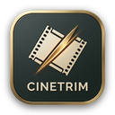

<p align="center">
  
</p>

<h1 align="center">Recortador y Editor de Videos MP4</h1>

<p align="center">
  <strong>Aplicación de escritorio de alto rendimiento para recorte ultrarrápido sin pérdida de calidad (Stream Copy) y edición multipista estilo Camtasia.</strong>
</p>

<p align="center">
  
  
  
  
  
  
</p>

---

## 📖 Descripción General

**Recortador y Editor de Videos MP4** es una solución de escritorio nativa para Windows diseñada para creadores de contenido, editores y usuarios que necesitan recortar videos al instante **sin perder un solo ápice de calidad**, añadir o mezclar pistas de audio y editar clips de forma visual con una línea de tiempo multipista interactiva.

A diferencia de los editores tradicionales que renderizan y recodifican todo el archivo (generando pérdida generacional de calidad y tiempos prolongados de espera), esta herramienta aprovecha la tecnología **Stream Copy (`-c copy`) de FFmpeg** para extraer y reempaquetar los flujos de video y audio en cuestión de segundos a la velocidad máxima del almacenamiento (SSD/HDD).

---

## ✨ Características Principales

* ⚡ **Recorte Ultrarrápido Sin Pérdida (*Lossless Cut*):**
  * Corte directo por *Stream Copy* sin recodificación.
  * Preservación al 100% de la resolución, tasa de bits (*bitrate*), tasa de cuadros (*fps*) y códec original (H.264, H.265/HEVC, etc.).
* 🎯 **Detección Inteligente de Keyframes (I-Frames):**
  * Análisis detallado de fotogramas clave con `ffprobe`.
  * Ajuste y alineación para cortes limpios sin cuadros negros ni congelamientos.
* 🎬 **Editor Multipista Estilo Camtasia:**
  * Línea de tiempo visual con regla de tiempo interactiva.
  * Soporte para múltiples pistas de audio superpuestas (`.mp3`, `.wav`, `.aac`, `.m4a`).
  * Arrastrar, posicionar temporalmente y recortar duración de clips de audio.
  * Sincronización precisa y reproducción en tiempo real vinculada al cabezal de lectura (*playhead*).
  * Control de volumen individual por clip y volumen maestro general.
* 🎵 **Gestión Flexible de Audio:**
  * **Conservar:** Mantiene el audio original del video.
  * **Silenciar:** Desactiva y remueve las pistas de audio (`-an`).
  * **Reemplazar:** Sustituye el audio original por una nueva pista musical o locución externa.
  * **Mezclar (*Audio Mix*):** Combina el audio nativo con música de fondo mediante filtros de balance de volumen (`amix`).
* 🔗 **Unión de Videos (*Merge / Concat*):**
  * Fusión secuencial de fragmentos o múltiples archivos compatibles en un único archivo de salida sin recodificar.
* 🖥️ **Interfaz Gráfica Moderna y Amigable:**
  * Diseño contemporáneo con tema oscuro optimizado.
  * Soporte *Drag & Drop* para archivos de video y pistas de audio.
  * Previsualización fluida y atajos de teclado intuitivos.
  * Indicador de progreso de exportación y logs en vivo.

---

## 🏛️ Arquitectura de Software

El proyecto ha sido concebido desde sus cimientos siguiendo los estándares de **Clean Architecture (Robert C. Martin)** y los principios **SOLID**:

```
                              ┌────────────────────────────────────────┐
                              │          4. Presentación / UI          │
                              │     (WPF Desktop / MVVM Pattern)       │
                              └───────────────────┬────────────────────┘
                                                  │ depende de
                                                  ▼
                              ┌────────────────────────────────────────┐
                              │         3. Casos de Uso (App)          │
                              │   (TrimVideoUseCase, AnalyzeVideo...)  │
                              └─────────┬──────────────────────┬───────┘
                             depende de │                      │ implementado por
                                        ▼                      ▼
                     ┌────────────────────────┐      ┌────────────────────────┐
                     │       1. Dominio       │      │   2. Infraestructura   │
                     │(Entities, ValueObjects,│◄─────┤(FFmpeg, ProcessRunner, │
                     │   Domain Exceptions)   │  DIP │  File System, Windows) │
                     └────────────────────────┘      └────────────────────────┘
```

* **`RecortadorDeVideos.Domain`**: Núcleo puro sin dependencias externas. Define entidades de negocio, agregados (`CutJob`, `AudioTrackConfig`) y objetos de valor inmutables (`TimeRange`).
* **`RecortadorDeVideos.Application`**: Casos de uso (`TrimVideoUseCase`, `AnalyzeVideoUseCase`, etc.) y contratos/interfaces (puertos de entrada y salida).
* **`RecortadorDeVideos.Infrastructure`**: Implementación concreta de los adaptadores multimedia con FFmpeg/FFprobe, localizador de binarios y ejecución de subprocesos con lectura asíncrona de progreso.
* **`RecortadorDeVideos.UI`**: Capa de presentación WPF con patrón MVVM, enlace de datos bidireccional (*data binding*), controles desacoplados e inyección de dependencias (`Microsoft.Extensions.DependencyInjection`).

---

## ⌨️ Atajos de Teclado

| Atajo | Acción |
| :--- | :--- |
| <kbd>Espacio</kbd> | Reproducir / Pausar video o previsualización |
| <kbd>[</kbd> | Fijar punto de inicio del recorte (*In-Point*) |
| <kbd>]</kbd> | Fijar punto de finalización del recorte (*Out-Point*) |
| <kbd>F11</kbd> | Alternar modo pantalla completa |
| <kbd>←</kbd> / <kbd>→</kbd> | Salto de 5 segundos hacia atrás / adelante |
| <kbd>Ctrl</kbd> + <kbd>←</kbd> / <kbd>→</kbd> | Salto fino de 1 segundo |

---

## ⚙️ Requisitos del Sistema

* **Sistema Operativo:** Windows 10 (1809 o superior) o Windows 11 (x64).
* **Entorno de Ejecución:** [.NET 8 Desktop Runtime](https://dotnet.microsoft.com/download/dotnet/8.0) (o [.NET 8 SDK](https://dotnet.microsoft.com/download/dotnet/8.0) para compilar).
* **Motor Multimedia:** [FFmpeg](https://ffmpeg.org/) (incluyendo `ffprobe`).

---

## 🚀 Instalación y Puesta en Marcha

### 1. Clonar el Repositorio
```bash
git clone https://github.com/FirstRSSO/video_editor.git
cd video_editor
```

### 2. Instalar FFmpeg
Puedes instalar FFmpeg fácilmente mediante Windows Package Manager (`winget`):
```powershell
winget install Gyan.FFmpeg
```
*(Asegúrate de que `ffmpeg` y `ffprobe` estén accesibles en el `PATH` de tu sistema o ubicados en una carpeta detectada por la aplicación).*

### 3. Compilar el Proyecto
```powershell
dotnet build
```

### 4. Ejecutar la Aplicación
```powershell
dotnet run --project src/RecortadorDeVideos.UI/RecortadorDeVideos.UI.csproj
```

---

## 🧪 Pruebas Automatizadas

La solución incluye suites de pruebas unitarias y de integración que validan la lógica de negocio, los casos de uso y la comunicación con los binarios de FFmpeg:

```powershell
# Ejecutar todas las pruebas
dotnet test

# Ejecutar únicamente pruebas unitarias
dotnet test tests/RecortadorDeVideos.Domain.UnitTests/
dotnet test tests/RecortadorDeVideos.Application.UnitTests/

# Ejecutar pruebas de integración contra FFmpeg
dotnet test tests/RecortadorDeVideos.Infrastructure.IntegrationTests/
```

---

## 📁 Estructura del Repositorio

```
recortadorDeVideos/
├── docs/                                  # Documentación técnica y planes de desarrollo
│   ├── ARCHITECTURE.md                    # Especificación formal de arquitectura y SOLID
│   └── PLAN.md                            # Fases de implementación e investigación técnica
├── src/                                   # Código fuente principal
│   ├── RecortadorDeVideos.Domain/         # Entidades, Value Objects y reglas de negocio
│   ├── RecortadorDeVideos.Application/    # Casos de uso y contratos de servicios
│   ├── RecortadorDeVideos.Infrastructure/ # Adaptadores para FFmpeg, FFprobe y FileSystem
│   └── RecortadorDeVideos.UI/             # Interfaz gráfica WPF (MVVM, Vistas, Controles)
├── tests/                                 # Proyectos de pruebas xUnit
│   ├── RecortadorDeVideos.Domain.UnitTests/
│   ├── RecortadorDeVideos.Application.UnitTests/
│   └── RecortadorDeVideos.Infrastructure.IntegrationTests/
└── RecortadorDeVideos.sln                 # Solución principal de Visual Studio / .NET
```

---

## 📄 Licencia

Este proyecto se distribuye bajo la licencia **MIT**. Consulta el archivo `LICENSE` para más información.
